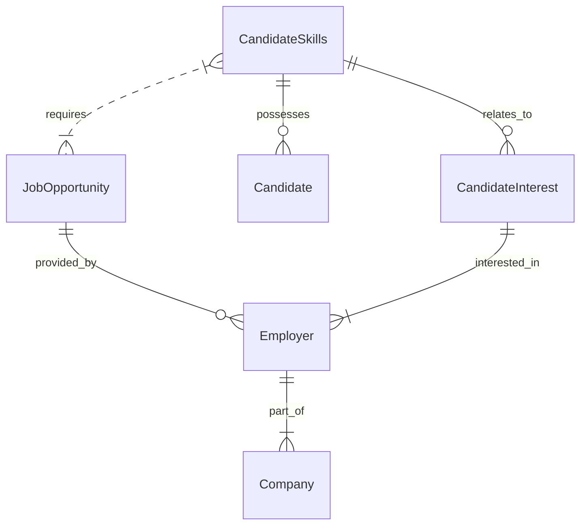
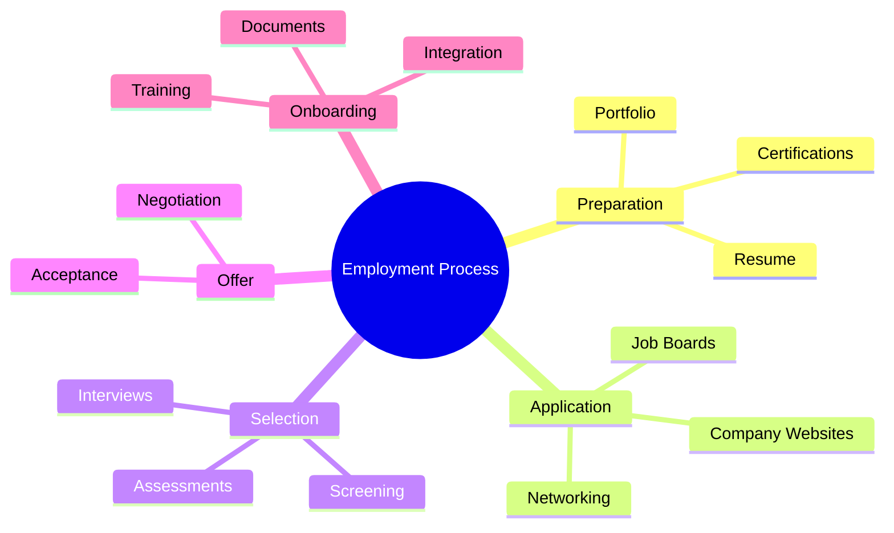

# Portfolio

## What is a Portfolio?

A portfolio is a collection of work, projects, or accomplishments that showcases your skills, experience, and creativity.

> I can't publicly share the projects I've worked on due to confidentiality, so I'm highlighting my skills and thought process instead.

---

## Documentation Skills

I have experience with documentation tools such as **Mermaid** and **Astah**, and I'm currently learning **PlantUML** to expand my diagramming capabilities.

### Entity-Relationship Diagram

For this project, I created an ER diagram to illustrate the relationship between a candidate (me) and potential employers:

### Employment Process Mindmap

To better understand and represent the employment journey, I created a mindmap using Mermaid:

## About the Project

I took some time to reflect on the traditional job-hunting process—and instead of sending out tons of resumes to countless companies, I decided to flip the script.

This project is my way of saying:
“Here’s who I am, here’s what I can do—now tell me what opportunities you have.”

So, if you’re an employer or recruiter and you see potential here, feel free to send me your job opportunity. Let’s connect and build something great together.

### How can you send me your opportunity

> In progress